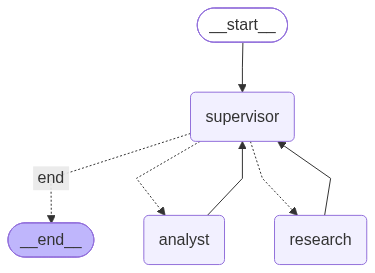

# Chess Tactics Orchestrator

Multi-agent hierarchical system for analyzing chess games from Lichess with an LLM-powered natural language interface.

Ask questions like _"How did I do with the Sicilian in the last 3 months?"_ and get comprehensive analysis combining:
- Real game data from Lichess API
- Quantitative metrics (winrate, blunders, endgame performance)
- Natural language interpretation via Gemini
- Supervised validation to ensure quality

## Architecture

### System Diagram



```
                 ┌─────────────┐
      ┌─────────▶│  Supervisor │◀─────────┐
      │          └──────┬──────┘          │
      │                 │ routing         │
      │                 │ (Literal)       │
      │      ┌──────────┼──────────┐      │
      │      ▼          ▼          ▼      │
      │ Investigación  Análisis    END     │
      │  (research)    (analyst)           │
      │      │          │                  │
      └──────┴──────────┴──────────────────┘
        (results loop back for validation)
```

### Agent Topology Justification

This **hierarchical supervisor architecture** was chosen over alternatives (sequential pipeline, peer-to-peer) for these reasons:

1. **Dynamic routing** — The supervisor can skip agents or loop back based on intermediate results. If games are already sufficient, research isn't re-invoked. If analysis has gaps, the supervisor targets the specific agent to refine.

2. **Validation gate** — The supervisor acts as a quality checkpoint before returning results to the user, applying explicit rubrics (§ Validation Rubric) instead of blindly trusting specialist outputs.

3. **Conflict resolution** — When agents report incompatible states (e.g., analyst says "not enough data" but research says "done"), the supervisor arbitrates by checking hard constraints (game count, refinement limit) and deciding who to re-invoke.

4. **Loop cutoff** — The supervisor enforces a hard limit (`refinement_count <= 2`) to prevent infinite cycles if research and analyst keep passing blame.

Alternative topologies considered:

- **Sequential pipeline** (research → analyst → end): No way to refine or loop back if initial results are poor.
- **Peer-to-peer** (agents message each other directly): Risk of desynchronization, no central authority to enforce constraints.
- **Flat coordinator** (all agents report to shared state, no supervisor): Would need to duplicate validation logic in every agent.

## Metrics Computed

The Analyst Agent computes **5 metrics** from the fetched games:

| # | Metric | Source | Cost |
|---|--------|--------|------|
| 1 | **Winrate by opening** | Lichess API metadata | None |
| 2 | **Winrate by color** (white/black) | Lichess API metadata | None |
| 3 | **Game termination types** (time/mate/resign) | Lichess API metadata | None |
| 4 | **Winrate by endgame type** (pawn/rook/minor piece/queen/mixed) | Material classification with `python-chess` | Low (no engine) |
| 5 | **Tactical patterns missed** (hanging piece, fork, missed mate) | Stockfish + geometric heuristics on real games | High (position eval) |

### Why Tactical Patterns Come from Real Games, Not Puzzle Dashboard

Lichess has a puzzle dashboard (`GET /api/puzzle/dashboard/{days}`) with performance by theme (fork, pin, etc.), but it only reflects **puzzle-solving** performance, not **real-game mistakes**.

To answer "where do I blunder in my actual games?", we analyze games directly:

1. **Detect blunders**: Compare eval before/after each move, flag drops > 150 centipawns.
2. **Classify patterns** using geometric heuristics with `python-chess`:
   - **Hanging piece**: Captured piece had more attackers than defenders.
   - **Fork**: Best move attacks 2+ valuable pieces simultaneously.
   - **Missed mate**: Stockfish shows mate in N, player didn't play it.

Subtle patterns (pins, discovered attacks, positional errors) are out of scope and declared as limitations (§ Known Limitations).

The puzzle dashboard can be integrated as **optional enrichment** (if user has puzzle history, add it to `analysis_metadata`), but never as the primary source.

## Conflict Handling Between Agents

Conflicts between agents are resolved via the **Supervisor's validation rubric** and **hard deterministic checks**:

### 1. Resource Dependencies

**Conflict**: Analyst tries to run before Research has fetched games.

**Resolution**: Supervisor checks `games_raw` before routing. If empty, always routes to `research` first (deterministic rule in `supervisor.py:route`).

### 2. Contradictory Signals

**Conflict**: Analyst reports `answers_user_question: False` or non-empty `gaps`, but Research claims "done".

**Resolution**: Supervisor validates results against rubric:
- **Completeness**: `games_analyzed >= 10`?
- **Gaps**: Did analyst report limitations?
- **Relevance**: Do games match user filters?

If validation fails, `needs_refinement` is set to `True` and `refine_target` specifies which agent to re-invoke.

### 3. Infinite Loops

**Conflict**: Research and Analyst keep flagging each other for refinement in a cycle.

**Resolution**: `refinement_count` hard limit (max 2 cycles). When hit, Supervisor forces `route → "end"` and the `final_answer` must explicitly state limitations:

```python
if state["refinement_count"] >= MAX_REFINEMENT_CYCLES:
    return "end"  # Hard cutoff, return partial results
```

### 4. Source of Truth

**Conflict**: Agents read each other's raw outputs in inconsistent formats.

**Resolution**: All communication goes through `AgentState` (typed schema in `state.py`). No side channels, no global variables. Each agent writes to specific fields:
- Research → `games_raw`
- Analyst → `analysis_result`
- Supervisor → `needs_refinement`, `refine_target`

The `contributions` field uses `Annotated[list[Contribution], operator.add]` so each agent appends without overwriting others' logs.

## Installation

### Prerequisites

- Python 3.11+
- [uv](https://github.com/astral-sh/uv) package manager
- Stockfish (optional, for fallback evaluation)

### Setup

1. Clone the repository:

```bash
git clone <repo-url>
cd chess-tactics-orchestrator
```

2. Install dependencies:

```bash
uv sync
```

3. Create `.env` file:

```bash
cp .env.example .env
# Edit .env and add your GEMINI_API_KEY
```

4. (Optional) Install Stockfish:

```bash
# macOS
brew install stockfish

# Ubuntu/Debian
sudo apt-get install stockfish

# Or download from https://stockfishchess.org/download/
```

## Usage

### Command Line

```bash
uv run chess-tactics <username> <question>
```

**Examples:**

```bash
# Basic query
uv run chess-tactics DrNykterstein "How did I do with the Sicilian?"

# Time range
uv run chess-tactics DrNykterstein "My blitz performance in the last 3 months"

# Detailed trace
uv run chess-tactics -v DrNykterstein "Where do I lose with the King's Indian?"
```

### Programmatic Usage

```python
from chess_tactics_orchestrator.graph import run_query

result = run_query(
    user_request="How did I do with the Sicilian in the last 3 months?",
    username="DrNykterstein"
)

print(result["final_answer"])
```

## Project Structure

```
chess-tactics-orchestrator/
├── CLAUDE.md                          # Project context for Gemini Code
├── README.md                          # This file
├── pyproject.toml                     # uv project config
├── .env.example                       # Environment template
├── generate_diagram.py                # Script to regenerate graph.png
├── assets/
│   └── graph.png                      # Graph diagram (auto-generated)
├── chess_tactics_orchestrator/        # Main package
│   ├── __init__.py
│   ├── state.py                       # AgentState schema with reducer
│   ├── graph.py                       # StateGraph definition
│   ├── main.py                        # CLI entry point
│   ├── agents/
│   │   ├── __init__.py
│   │   ├── research_agent.py          # Fetches games from Lichess
│   │   ├── analyst_agent.py           # Computes 5 metrics + LLM interpretation
│   │   └── supervisor.py              # Routing + validation
│   └── tools/
│       ├── __init__.py
│       ├── lichess_client.py          # Lichess API wrapper
│       ├── stockfish_eval.py          # Position evaluation (Lichess → Stockfish fallback)
│       └── tactic_detector.py         # Blunder classification + endgame typing
└── tests/                             # Unit tests
    ├── test_state.py
    ├── test_research_agent.py
    ├── test_analyst_agent.py
    └── test_supervisor.py
```

## Validation Rubric

The Supervisor applies this rubric before allowing `END`:

### Deterministic Checks (no LLM)

1. **Minimum games**: `len(games_raw) >= 10`
2. **Analysis exists**: `analysis_result is not None`
3. **No gaps**: `analysis_result["gaps"]` is empty

### LLM-Based Validation (if deterministic checks pass)

Supervisor sends structured prompt:

```
Evaluate against:
1. Completeness: >= 10 games?
2. Relevance: Games match user filters?
3. Depth: Analysis beyond simple aggregates?
4. Gaps: Agent reported limitations?

Respond:
COMPLETE: yes/no
REASON: <one sentence>
REFINE_TARGET: research/analyst/none
INSTRUCTIONS: <specific improvements>
```

If `COMPLETE: no`, the supervisor sets `needs_refinement=True` and routes to `refine_target`.

## Known Limitations

### Tactical Pattern Detection

The heuristic-based detector is limited to **3 reliably detectable patterns**:

- ✅ **Hanging pieces** (undefended captures)
- ✅ **Forks** (2+ valuable pieces attacked)
- ✅ **Missed mates** (Stockfish says mate in N, player didn't play it)

**Out of scope** (would require ML or complex board understanding):
- ❌ Pins
- ❌ Skewers
- ❌ Discovered attacks
- ❌ Deflection/decoy tactics
- ❌ Positional/strategic errors

Unclassified blunders are tagged as `"unclassified"` in the output.

### Performance

- **Move analysis** is limited to 20 games and samples every 3rd move by default to keep runtime reasonable (< 1 minute on typical queries).
- For deep analysis, users can modify `sample_moves=False` in `analyst_agent.py:compute_metrics`.

### Stockfish Dependency

If Stockfish is not installed and games lack Lichess server analysis, evaluation falls back to errors. The system reports eval source counts in `analysis_metadata`:

```json
{
  "eval_sources": {
    "lichess": 28,
    "stockfish": 12
  }
}
```

## Development

### Running Tests

```bash
uv run pytest
```

### Regenerating Graph Diagram

```bash
uv run python generate_diagram.py
```

### Adding a New Metric

1. Implement computation in `analyst_agent.py:compute_metrics`
2. Add to interpretation prompt in `analyst_agent.py:interpret_metrics`
3. Update this README's metrics table

### Adding a New Agent

1. Create `chess_tactics_orchestrator/agents/new_agent.py`
2. Define a node function: `def new_agent_node(state: AgentState) -> dict`
3. Register in `graph.py`: `workflow.add_node("new_agent", new_agent_node)`
4. Update supervisor routing logic in `supervisor.py:route`

## License

MIT

## Contributing

See [CLAUDE.md](CLAUDE.md) for project context and architecture decisions.
